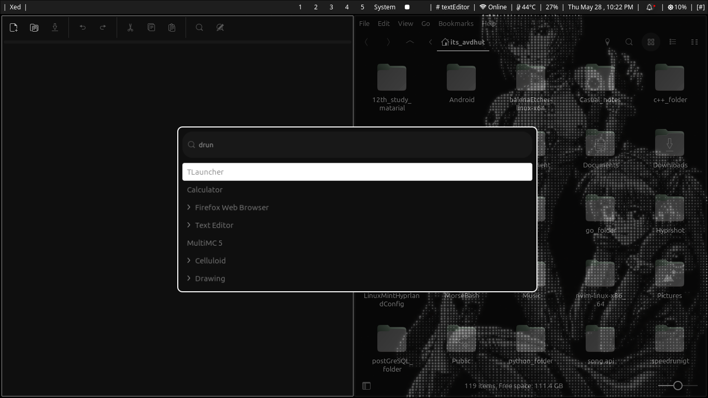

# LinuxMintHyprlandConfig

A personal dotfile repo for my Mint + Hyprland setup. Dark, minimal, and opinionated — don't expect things to be neatly organized.

---

> [!WARNING]
> This is built specifically for **Debian-based** systems — **Linux Mint** in particular — with **Hyprland** already installed.
> If you're on a different Debian-based distro, remove the `checkIfDebian` function call from `install.sh` before running it.

---

# Installing Hyprland on Linux Mint

<details>
<summary><b>Click to expand installation steps</b></summary>

This guide covers installing the Hyprland Wayland compositor on Linux Mint using an automated script.

> [!NOTE]
> **Credits:** This setup uses the automation scripts and configurations maintained by **JaKooLit**. Consider starring the original repo to support the developer.
>
> **Original Repository:** [JaKooLit/Ubuntu-Hyprland](https://github.com/JaKooLit/Ubuntu-Hyprland)

---

## Step 1: Prepare System Dependencies

Update your package lists and install the core utilities needed for cloning and building.

```bash
sudo apt update && sudo apt upgrade -y
sudo apt install git make cmake -y
```

## Step 2: Identify Your Mint Version Base

Linux Mint releases are built on top of specific Ubuntu LTS bases. Target the branch that matches your version:

- **Linux Mint 22** → based on **Ubuntu 24.04**
- **Linux Mint 21 (21.1, 21.2, 21.3)** → based on **Ubuntu 22.04**

## Step 3: Clone the Correct Branch

### For Linux Mint 22:

```bash
cd ~
rm -rf Ubuntu-Hyprland
git clone -b 24.04 --depth 1 https://github.com/JaKooLit/Ubuntu-Hyprland.git
```

### For Linux Mint 21:

```bash
cd ~
rm -rf Ubuntu-Hyprland
git clone -b 22.04 --depth 1 https://github.com/JaKooLit/Ubuntu-Hyprland.git
```

## Step 4: Run the Installer

Navigate into the cloned directory, make the installer executable, and run it.

```bash
cd Ubuntu-Hyprland
chmod +x install.sh
./install.sh
```

## Step 5: Follow the Interactive Prompts & Reboot

The setup menu will guide you through the process:

1. Enter your `sudo` password when prompted.
2. Choose options matching your hardware — especially if you're on an **Nvidia** GPU.
3. Select additional features like Waybar or custom GTK themes.
4. Reboot once complete.

## Step 6: Log Into Hyprland

1. On the Linux Mint login screen, select your username.
2. Click the session icon (usually a small gear near the password field).
3. Select **Hyprland** from the list.
4. Enter your password and log in.

---

### Additional Resources

- [How to Install Hyprland on Ubuntu + Linux Mint (Video Guide)](https://youtube.com)

</details>

---

# Installation

## Quick Start

```bash
# 1. Clone the repository
git clone https://github.com/yourusername/LinuxMintHyprlandConfig.git
cd LinuxMintHyprlandConfig

# 2. Run the install script
chmod +x install.sh
./install.sh

# 3. Follow the interactive prompts
```

## What `install.sh` Does

1. ✅ Creates symlinks for all configs → `~/.config/`
2. ✅ Creates symlinks for all scripts → `~/.local/bin/`
3. ✅ Installs GTK theme → `~/.themes/`
4. ✅ Sets GTK theme system-wide via `gsettings`
5. ✅ Optionally installs Hyprshot for screenshots

---

# GTK Theme

## Automatic

The install script handles this automatically. Nothing to do.

## Manual Installation

If you want to install the **Graphite-Dark** theme on its own:

```bash
mkdir -p ~/.themes
cp -r ./theme/gtkThemes/Graphite-Dark ~/.themes/
```

**Via Linux Mint GUI:**
1. Open **System Settings** → **Appearance** → **Themes**
2. Select **Graphite-Dark** from the GTK+ Theme dropdown

**Via command line:**
```bash
gsettings set org.cinnamon.desktop.interface gtk-theme "Graphite-Dark"
gsettings set org.gnome.desktop.interface gtk-theme "Graphite-Dark"
```

## Troubleshooting

**Theme not applying globally:**
```bash
gsettings reset org.cinnamon.desktop.interface gtk-theme
gsettings set org.cinnamon.desktop.interface gtk-theme "Graphite-Dark"
# Then log out and back in
```

**Reverting to default:**
```bash
gsettings reset org.cinnamon.desktop.interface gtk-theme
```

---

# Preview


---



---


---

# Wallpapers

<details>
  <summary>Wallpaper 1 — Full Blank Background</summary>
  <br>
  
</details>

<details>
  <summary>Wallpaper 2 — Dark Ocean Current</summary>
  <br>
  
</details>

<details>
  <summary>Wallpaper 3 — Classic Nokia Handshake</summary>
  <br>
  
</details>

<details>
  <summary>Wallpaper 4 — Solo Rei Ayanami</summary>
  <br>
  
</details>

<details>
  <summary>Wallpaper 5 — Rei and Asuka Manga Version</summary>
  <br>
  
</details>

---

# Repository Structure

All configs, themes, and scripts are managed from a single source directory and linked to their appropriate locations via symlinks — no files are duplicated or moved from the repo.

```
LinuxMintHyprlandConfig/
├── bin/                              # Custom scripts (→ ~/.local/bin/)
│   ├── brightnessCheck.sh           # Brightness control via ddcutil
│   ├── startup.sh                   # Hyprland startup script
│   ├── wofiDrawer.sh                # Wofi app launcher integration
│   ├── custom-launch-btop.sh        # Custom btop launcher
│   ├── custom-open-link.sh          # Web link opener
│   ├── gnome-terExit.sh             # Terminal exit handler
│   └── codecho.sh                   # Code clipboard utility
├── config/                           # App configs (→ ~/.config/)
│   ├── hypr/                        # Hyprland compositor
│   │   ├── hyprland.conf            # Main config
│   │   ├── hypridle.conf            # Idle & screen lock behavior
│   │   ├── hyprlock.conf            # Lock screen config
│   │   ├── webappsbinds.conf        # Web app keybindings
│   │   └── workspace.conf           # Workspace & monitor setup
│   ├── waybar/                      # Status bar
│   │   ├── config.jsonc
│   │   └── style.css
│   ├── wofi/                        # App launcher
│   │   ├── config
│   │   ├── style.css
│   │   └── SearchBarStyle.css
│   └── btop/                        # System monitor
│       ├── btop.conf
│       └── theme/
├── theme/                            # Theming files
│   ├── gtkThemes/
│   │   └── Graphite-Dark/           # Dark GTK theme (→ ~/.themes/)
│   └── Obsidian/
│       └── pitchBlack/              # Pitch Black Obsidian theme (optional)
├── icon/                            # Web app launcher icons
├── wallpaper/                       # Desktop wallpapers (5 total)
├── install.sh                       # Installs everything
├── uninstall.sh                     # Removes symlinks & restores backups
├── tools.conf                       # Required system tools reference
├── README.md                        # This file
└── PreviewImage*.png                # Screenshots
```

## What Gets Installed

| Component | Source | Target | Notes |
| --- | --- | --- | --- |
| **Hyprland Config** | `config/hypr/` | `~/.config/hypr/` | Wayland compositor config |
| **Waybar** | `config/waybar/` | `~/.config/waybar/` | Status bar config |
| **Wofi** | `config/wofi/` | `~/.config/wofi/` | App launcher config |
| **Btop** | `config/btop/` | `~/.config/btop/` | System monitor theme |
| **Custom Scripts** | `bin/` | `~/.local/bin/` | Brightness, wofi drawer, etc. |
| **GTK Theme** | `theme/gtkThemes/Graphite-Dark/` | `~/.themes/` | Auto-applied via gsettings |

---

# Hyprshot

Hyprshot is the screenshot utility used in this setup. It's integrated via these keybindings:

| Keybinding | Action |
|---|---|
| `Print` | Capture current monitor |
| `Super + Print` | Capture active window |
| `Shift + Print` | Capture region (drag to select) |

## Installation

The install script will prompt you automatically. Select option **1** to auto-install.

### Manual Installation

```bash
# 1. Clone
git clone https://github.com/Gustash/hyprshot.git ~/Hyprshot

# 2. Make executable
chmod +x ~/Hyprshot/hyprshot

# 3. Symlink
mkdir -p ~/.local/bin
ln -s ~/Hyprshot/hyprshot ~/.local/bin/hyprshot

# 4. Verify
hyprshot --help
```

If `hyprshot` isn't found after install, make sure `~/.local/bin` is in your PATH:

```bash
export PATH="$HOME/.local/bin:$PATH"
source ~/.bashrc
```

## Usage

```bash
hyprshot -m output    # capture monitor
hyprshot -m window    # capture window
hyprshot -m region    # capture region
hyprshot -m region -o ~/custom.png  # save to custom path
```

Screenshots are saved to `~/Pictures/Screenshots/` by default.

## Troubleshooting

**Command not found:**
1. `ls -l ~/.local/bin/hyprshot` — check symlink exists
2. `echo $PATH | grep .local/bin` — check PATH
3. Add `export PATH="$HOME/.local/bin:$PATH"` to `~/.bashrc` and re-source

**Screenshot save fails:**
```bash
mkdir -p ~/Pictures/Screenshots
chmod 755 ~/Pictures/Screenshots
```

**Keybinding not working:**
1. Check Hyprshot is installed: `command -v hyprshot`
2. Try the command directly: `hyprshot -m region`
3. Reload Hyprland: `Super + Escape` → log back in

## Uninstalling

```bash
rm ~/.local/bin/hyprshot
rm -rf ~/Hyprshot
```

---

### Resources

- [Hyprshot Repository](https://github.com/Gustash/hyprshot)
- [Hyprland Wiki — Bindings](https://wiki.hyprland.org/Configuring/Binds/)
