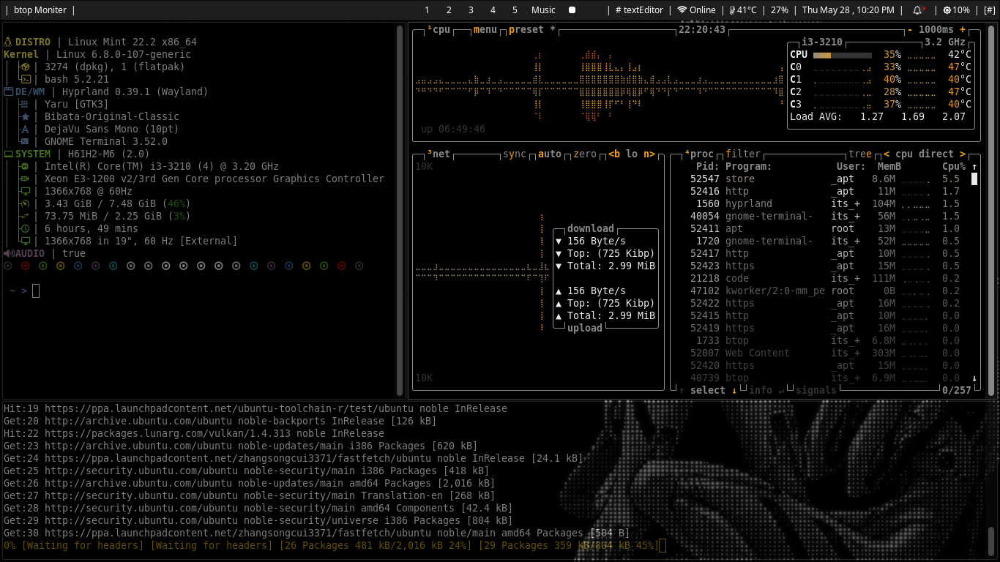
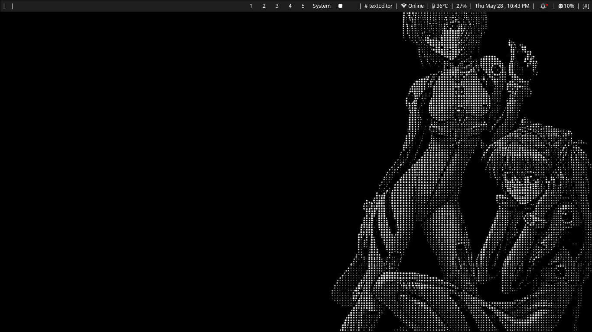
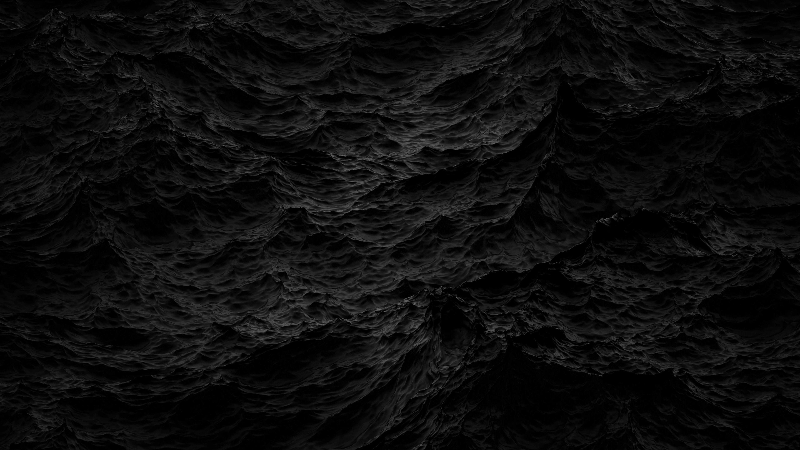
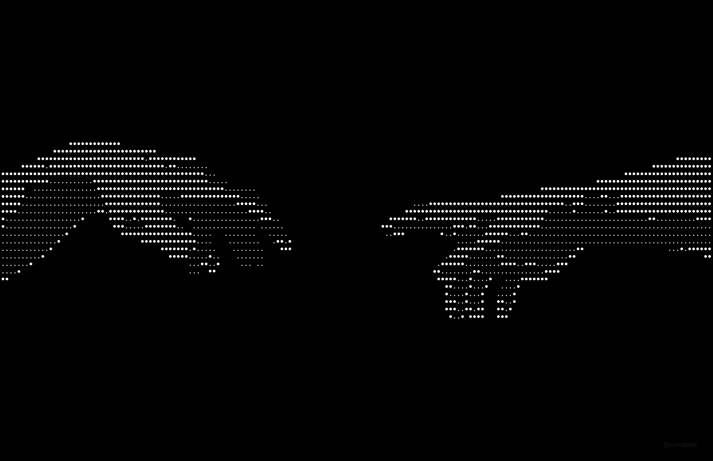
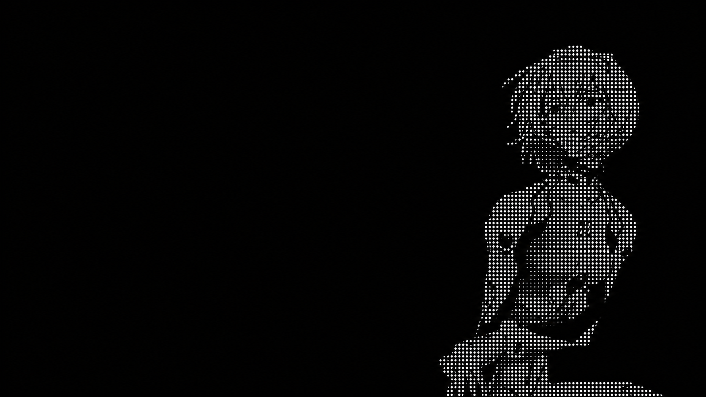
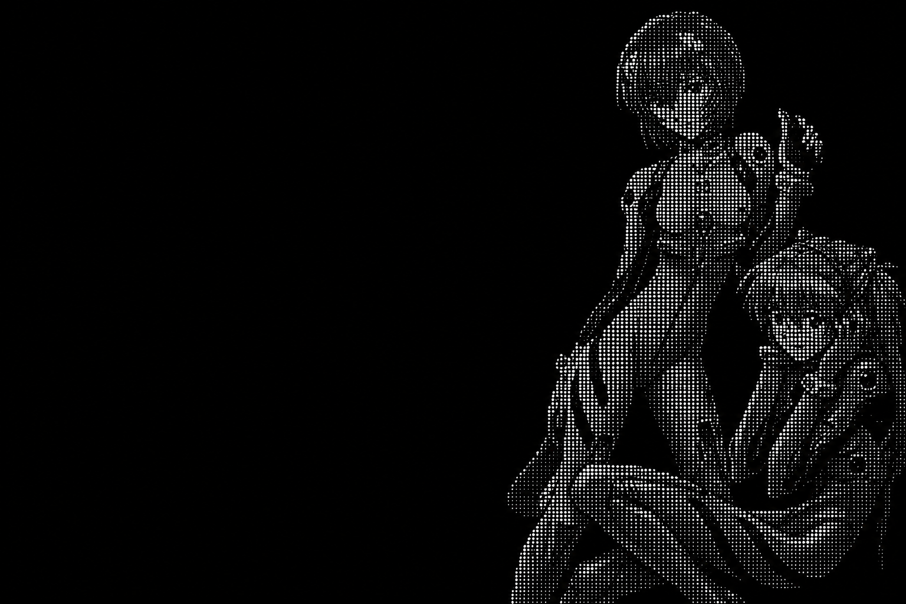

# LinuxMintHyprlandConfig

This an custom .dotfile repo for my personal mint-hyprland setup. So its dark, minimal, dosent follow a structure , just stuff randomly everywhere.

__________________________________________________________________________________________

# Warning 

this is only for **debian** based [mint to be specfic] systems with it having **Hyprland**

__________________________________________________________________________________________

# Preview Images 

1.
__________________________________________________________________________________________

2.![Second preview Image, with showing the themeing of the editor [xed] and file manger [nemo].](PreviewImage2.png)
__________________________________________________________________________________________

3.
__________________________________________________________________________________________

# Wallpaper 

  
Wallpaper 1 - Full Blank Background.

   
  

  
Wallpaper 2 - Dark Ocean Current (ig).

   
  

  
Wallpaper 3 - Classic Nokia Handshake.

   
  

  
Wallpaper 4 - Solo Rai Ayanamai.

   
  

  
Wallpaper 5 - Rai and Asuka Manga Version.

   
  

__________________________________________________________________________________________

# Structure of .dotfile

31 may
__________________________________________________________________________________________

# Installation

1 june
__________________________________________________________________________________________